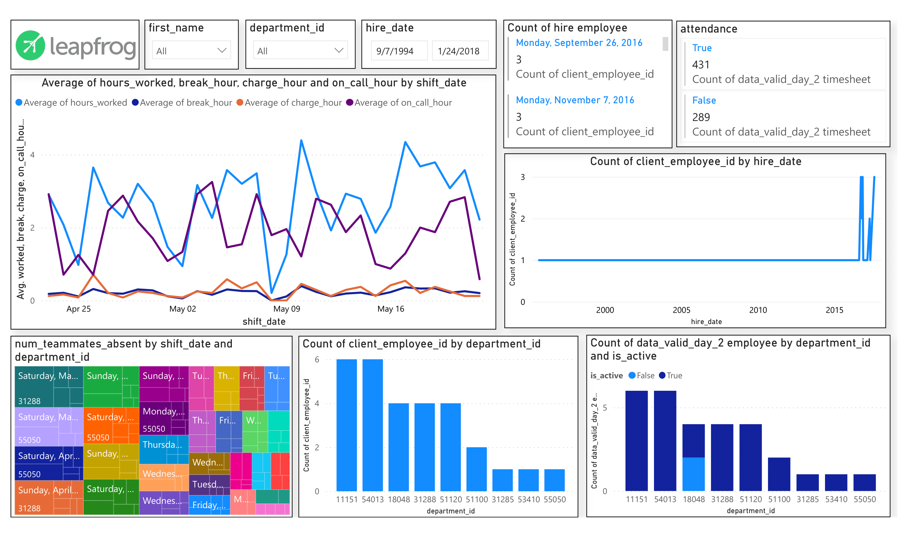

# Data Visualization (Power Bi)
While visualizing the employee and timesheet data, I have used line graph, bar graph, stack bar graph, multiple card, and slicer. The slicer is used to select the required data. 
The `first_name` slicer is used to select the name of employee on the basis of which the following graphs will show the detail.  
The `department_id` slicer is used to select the department id on the basis of which the graphs will show the detail. And so do the hire_date slicer behave.  
The `Count of hire employee` card shows that the total number of employees who got hire of specific date. The ‘attendance’ card will shows the total number of attendance who got present till the last date in dataset as count of ‘True’ and the total number of absent who got absent till the last date in dataset as count of ‘False’. 
In order to show the comparison among the average worked hours, average break hour, average charge hour, average on_call_hour I have used the line chart. This chart shows that the average hours_worked and average on_call_hour are going side by side.  Whereas average break_hour and average charge_hour is going through in same trend. The `blue` line in graph shows the average of hours_worked, the `purple` line shows the average on_call_hours, the `orange` line shows the average charge_hour, and the `dark blue` line shows the average break_hour.  
The `Count of client_employee_id by hire_date` shows the number of employee who got hire on any specific date in any specific department_id.  
The `num_teammates_absent by department_id and department_id` shows the number of team mates who are absent on the specific shift date in specific department. Here on 1st, May, 2021, in department 31288, there are total 30 absentees. I have used the treemap because the department are static.  
The `Count of client_employee_id by department_id` shows the number of employees who are enrolled in the specific department till last date in dataset. The department_id 11151 and 54013 has the highest number of employees i.e. 6. 
The `Count of data_valid_day_2 employee by department and is_active` graph shows that in any department how many employees are active till the last date in dataset and how many are inactive. The graph shows that the department_id 18048 has total employees 4 in which 2 are inactive and 2 are active. In department_id 11151 and 54013 has all the employees active.  

